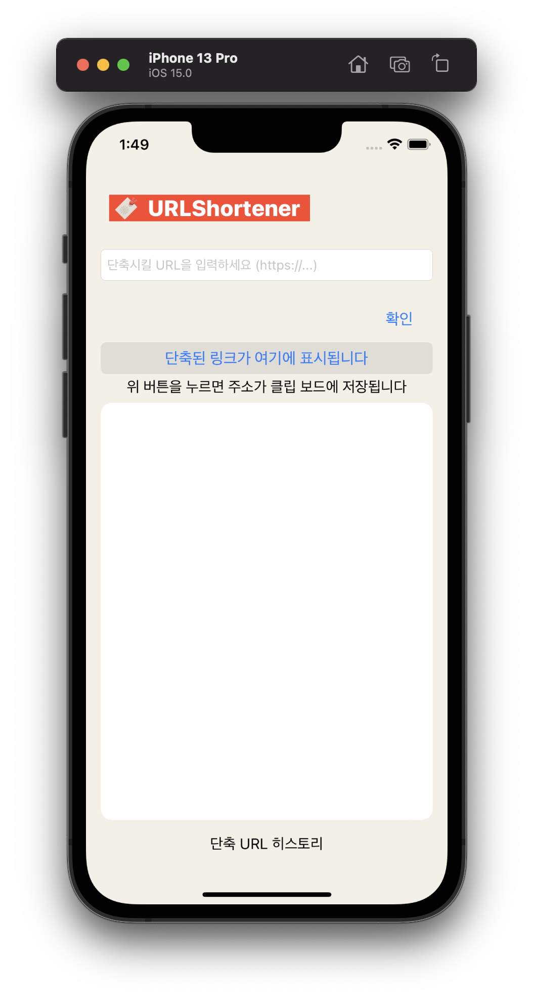
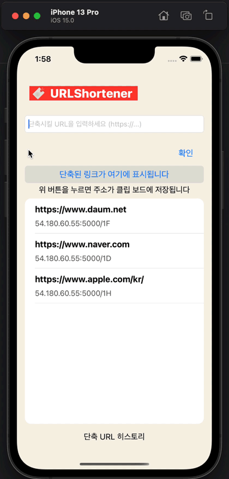
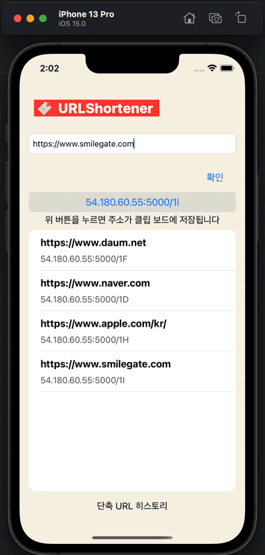
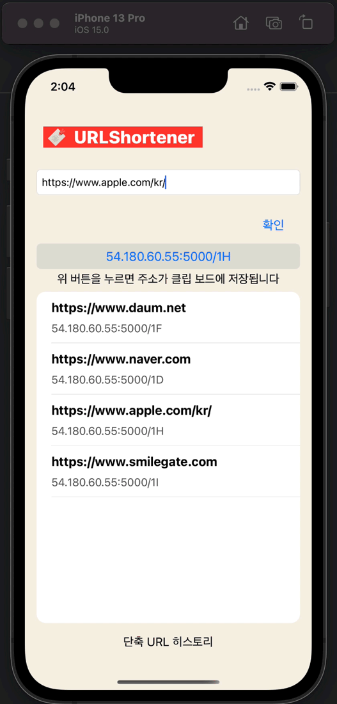

# URLShortenerProject
긴 URL을 짧은 URL로 만들어 제공하는 서비스를 구현하는 프로젝트

## Spec
- 주소 입력 폼에 URL을 입력하면 단축된 URL이 출력
- 단축 URL 입력 시 기존 URL로 Redirection
- 주소 입력 폼에 저장된 URL이 입력한적 있는 URL이면 동일한 단축 URL이 출력
- 결과값은 주소를 제외하고 8글자 이내로 생성

## 단축 URL 조사 및 구현 방법, 시나리오 정리
- https://broad-muenster-a6c.notion.site/STOVE-DEV-CAMP-5bbdafffbd7441e091e8412e1e2ce132

## Preview
  - Main

- URL Form Error
  - URL이 http:// 또는 https:// 로 시작하지 않을 때 UserNotification으로 알림

- URL Form Correct
  - 입력된 URL이 형식에 맞으면 단축시켜 Redirect 할 수 있는 링크 생성
  - 아래 버튼을 누르면 자동으로 클립보드에 복사

- URL Redirect
  - 생성된 단축URL을 접속하면 해당 링크로 Redirect

- App History Function
  - 단축시켰던 URL의 내역을 저장하는 TableView
  - 탭을 누르면 TextField와 버튼에 해당 링크 생성

- App History Delete
  - 히스토리에 저장된 링크를 슬라이드 액션으로 삭제
  - 내역에서만 삭제될 뿐이고 저장된 DB에서는 여전히 남아있음

## 기술 스택
- iOS Client

 `Swift`
- Server

`AWS`, `Flask`, `Flask_SQLAlchemy`, `SQLite3`